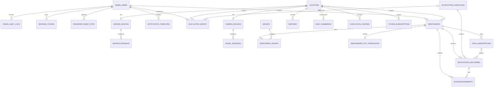

# Database Schema

PostgreSQL with async SQLAlchemy (asyncpg). This document reflects the SQLAlchemy
models and the Alembic migration chain through revision `e5f6a7b8c9d0`.
`DateTime(timezone=True)` columns are PostgreSQL timestamps with time zone. Columns
marked `DEFAULT UTC now` use `timezone('UTC', now())`; timestamps without that
marker must be supplied by the application or may be nullable.

## Entity Relationship Diagram

`system_settings` is a standalone key-value table and is omitted from the
relationship diagram.

## Tables

### admin_users

| Column | Type | Constraints |
|--------|------|-------------|
| id | UUID | PK, NOT NULL |
| phone_number | VARCHAR(20) | UNIQUE, NOT NULL |
| first_name | VARCHAR(50) | NOT NULL |
| last_name | VARCHAR(50) | NOT NULL |
| hashed_password | VARCHAR | NOT NULL |
| is_superuser | BOOLEAN | NULLABLE in DB, ORM default `false` |
| is_enabled | BOOLEAN | NULLABLE in DB, ORM default `true` |
| force_password_change | BOOLEAN | NULLABLE in DB, ORM default `true` |
| created_at | TIMESTAMPTZ | NOT NULL, DEFAULT UTC now |
| created_by | UUID | FK → `admin_users.id`, NULLABLE |
| last_login | TIMESTAMPTZ | NULLABLE |
| deactivated_at | TIMESTAMPTZ | NULLABLE |
| deactivated_by | UUID | FK → `admin_users.id`, NULLABLE |
| deactivation_reason | TEXT | NULLABLE |

### admin_audit_logs

| Column | Type | Constraints |
|--------|------|-------------|
| id | INTEGER | PK, AUTO, NOT NULL |
| admin_user_id | UUID | FK → `admin_users.id`, ON DELETE CASCADE, NOT NULL |
| action | VARCHAR(225) | NOT NULL |
| created_at | TIMESTAMPTZ | NOT NULL, DEFAULT UTC now |

### refresh_tokens

| Column | Type | Constraints |
|--------|------|-------------|
| id | UUID | PK, NOT NULL |
| admin_user_id | UUID | FK → `admin_users.id`, ON DELETE CASCADE, NOT NULL |
| token | VARCHAR | UNIQUE, NOT NULL |
| expires_at | TIMESTAMPTZ | NOT NULL |

### password_reset_otps

| Column | Type | Constraints |
|--------|------|-------------|
| id | INTEGER | PK, AUTO, NOT NULL |
| admin_id | UUID | FK → `admin_users.id`, NOT NULL |
| otp_code | VARCHAR(6) | NOT NULL |
| expires_at | TIMESTAMPTZ | NOT NULL |

### locations

| Column | Type | Constraints |
|--------|------|-------------|
| id | INTEGER | PK, AUTO, NOT NULL |
| name | VARCHAR(100) | UNIQUE, NOT NULL |
| latitude | FLOAT | NOT NULL |
| longitude | FLOAT | NOT NULL |

### sensor_devices

| Column | Type | Constraints |
|--------|------|-------------|
| id | INTEGER | PK, AUTO, NOT NULL |
| location_id | INTEGER | FK → `locations.id`, UNIQUE, NOT NULL |
| device_name | VARCHAR(100) | NOT NULL |
| sensor_config | JSON | NOT NULL; `installation_height`, `warning_threshold`, `critical_threshold` |

The unique `location_id` constraint makes this a one-to-zero-or-one relationship
from a location to a sensor device.

### sensor_readings

| Column | Type | Constraints |
|--------|------|-------------|
| id | INTEGER | PK, AUTO, NOT NULL |
| sensor_device_id | INTEGER | FK → `sensor_devices.id`, ON DELETE CASCADE, NOT NULL |
| water_level_cm | NUMERIC(5,2) | NOT NULL |
| raw_distance_cm | NUMERIC(5,2) | NOT NULL |
| signal_strength | INTEGER | NOT NULL; RSSI in dBm |
| timestamp | TIMESTAMPTZ | NOT NULL, DEFAULT UTC now |
| created_at | TIMESTAMPTZ | NOT NULL, DEFAULT UTC now |

**Indexes:** `id`, `timestamp`, and (`sensor_device_id`, `timestamp`).

### camera_devices

| Column | Type | Constraints |
|--------|------|-------------|
| id | INTEGER | PK, AUTO, NOT NULL |
| location_id | INTEGER | FK → `locations.id`, UNIQUE, NOT NULL |
| device_name | VARCHAR(100) | NOT NULL |

The unique `location_id` constraint makes this a one-to-zero-or-one relationship
from a location to a camera device.

### model_readings

| Column | Type | Constraints |
|--------|------|-------------|
| id | INTEGER | PK, AUTO, NOT NULL |
| camera_device_id | INTEGER | FK → `camera_devices.id`, ON DELETE CASCADE, NOT NULL |
| image_path | VARCHAR | NOT NULL |
| timestamp | TIMESTAMPTZ | NOT NULL, DEFAULT UTC now |
| created_at | TIMESTAMPTZ | NOT NULL, DEFAULT UTC now |
| blockage_percentage | FLOAT | NOT NULL; expected range 0–100 |
| blockage_status | VARCHAR | NOT NULL; `clear` / `partial` / `blocked` |

**Index:** `camera_device_id`.

### weather

| Column | Type | Constraints |
|--------|------|-------------|
| id | INTEGER | PK, AUTO, NOT NULL |
| location_id | INTEGER | FK → `locations.id`, NOT NULL |
| precipitation_mm | FLOAT | NOT NULL |
| weather_code | INTEGER | NOT NULL; WMO weather code |
| temperature_2m | FLOAT | NOT NULL; Celsius |
| relative_humidity_2m | FLOAT | NOT NULL; percentage |
| wind_speed_10m | FLOAT | NOT NULL; km/h |
| wind_direction_10m | FLOAT | NOT NULL; degrees |
| cloud_cover | FLOAT | NOT NULL; percentage |
| created_at | TIMESTAMPTZ | NOT NULL, DEFAULT UTC now |

### daily_summaries

| Column | Type | Constraints |
|--------|------|-------------|
| id | INTEGER | PK, AUTO, NOT NULL |
| location_id | INTEGER | FK → `locations.id`, ON DELETE CASCADE, NOT NULL |
| summary_date | DATE | NOT NULL |
| min_risk_score | INTEGER | NULLABLE |
| max_risk_score | INTEGER | NULLABLE |
| min_risk_timestamp | TIMESTAMPTZ | NULLABLE |
| max_risk_timestamp | TIMESTAMPTZ | NULLABLE |
| least_severe_blockage | VARCHAR | NULLABLE; `clear` / `partial` / `blocked` |
| most_severe_blockage | VARCHAR | NULLABLE; `clear` / `partial` / `blocked` |
| min_water_level_cm | NUMERIC(5,2) | NULLABLE |
| max_water_level_cm | NUMERIC(5,2) | NULLABLE |
| min_water_timestamp | TIMESTAMPTZ | NULLABLE |
| max_water_timestamp | TIMESTAMPTZ | NULLABLE |
| min_precipitation_mm | FLOAT | NULLABLE |
| max_precipitation_mm | FLOAT | NULLABLE |
| min_precip_timestamp | TIMESTAMPTZ | NULLABLE |
| max_precip_timestamp | TIMESTAMPTZ | NULLABLE |
| most_severe_weather_code | INTEGER | NULLABLE |
| created_at | TIMESTAMPTZ | NOT NULL, DEFAULT UTC now |

**Unique constraint:** (`location_id`, `summary_date`).

**Index:** `summary_date`.

### responders

| Column | Type | Constraints |
|--------|------|-------------|
| id | UUID | PK, NOT NULL |
| phone_number | VARCHAR(20) | UNIQUE, NOT NULL |
| first_name | VARCHAR(50) | NOT NULL |
| last_name | VARCHAR(50) | NOT NULL |
| status | `responderstatus` ENUM | NOT NULL; DB labels `PENDING` / `ACTIVE`; ORM default `PENDING` |
| location_id | INTEGER | FK → `locations.id`, NOT NULL, server DEFAULT `1` |
| activated_at | TIMESTAMPTZ | NULLABLE |
| notif_preferences | JSON | NOT NULL; server default enables `warning`, `critical`, `blockage`, and `announcement` |
| created_at | TIMESTAMPTZ | DEFAULT UTC now, NULLABLE in DB |
| created_by | UUID | FK → `admin_users.id`, NOT NULL |

### groups

| Column | Type | Constraints |
|--------|------|-------------|
| id | INTEGER | PK, AUTO, NOT NULL |
| name | VARCHAR(100) | UNIQUE, NOT NULL |

**Index:** `id`.

The application seeds the default group `All Active Responders` and prevents it
from being deleted.

### responder_groups

| Column | Type | Constraints |
|--------|------|-------------|
| responder_id | UUID | PK component, FK → `responders.id`, ON DELETE CASCADE, NOT NULL |
| group_id | INTEGER | PK component, FK → `groups.id`, ON DELETE CASCADE, NOT NULL |

**Composite primary key:** (`responder_id`, `group_id`).

### responders_otp_verification

| Column | Type | Constraints |
|--------|------|-------------|
| responder_id | UUID | PK, FK → `responders.id`, NOT NULL |
| otp_hash | VARCHAR | NOT NULL; Argon2 hash |
| created_at | TIMESTAMPTZ | NOT NULL, DEFAULT UTC now |
| expires_at | TIMESTAMPTZ | NOT NULL |
| attempt_count | INTEGER | NOT NULL, ORM default `0` |

**Index:** `responder_id`.

### notification_templates

| Column | Type | Constraints |
|--------|------|-------------|
| id | INTEGER | PK, AUTO, NOT NULL |
| type | `notificationtype` ENUM | NOT NULL; migration-defined labels `WARNING` / `CRITICAL` / `BLOCKAGE` / `ANNOUNCEMENT` |
| title | VARCHAR | NOT NULL |
| message | VARCHAR | NOT NULL |
| created_by_id | UUID | FK → `admin_users.id`, ON DELETE RESTRICT, NOT NULL |
| created_at | TIMESTAMPTZ | NOT NULL, DEFAULT UTC now |

**Indexes:** `id` and a partial unique index on `type` for `WARNING`,
`CRITICAL`, and `BLOCKAGE`. This permits multiple announcement templates.

The SQLAlchemy enum also declares `MAINTENANCE`, but it has not been added to the
PostgreSQL enum by a migration. See [Known model/migration drift](#known-modelmigration-drift).

### notification_dispatches

| Column | Type | Constraints |
|--------|------|-------------|
| id | INTEGER | PK, AUTO, NOT NULL |
| type | `notificationtype` ENUM | NOT NULL; same deployed labels and drift as `notification_templates.type` |
| title | VARCHAR | NOT NULL |
| message | VARCHAR | NOT NULL |
| created_at | TIMESTAMPTZ | NOT NULL, DEFAULT UTC now |

**Indexes:** `id` and `type`.

### notification_deliveries

| Column | Type | Constraints |
|--------|------|-------------|
| id | UUID | PK, NOT NULL |
| dispatch_id | INTEGER | FK → `notification_dispatches.id`, ON DELETE CASCADE, NOT NULL |
| responder_id | UUID | FK → `responders.id`, ON DELETE CASCADE, NOT NULL |
| subscription_id | UUID | FK → `push_subscriptions.id`, ON DELETE SET NULL, NULLABLE |
| status | `deliverystatus` ENUM | NOT NULL; DB labels `PENDING` / `SENT` / `FAILED`; ORM default `PENDING` |
| sent_at | TIMESTAMPTZ | NULLABLE |
| error_message | TEXT | NULLABLE |
| created_at | TIMESTAMPTZ | NOT NULL, DEFAULT UTC now |
| escalation_count | INTEGER | NOT NULL, DEFAULT `0` |

**Unique constraints:** (`dispatch_id`, `responder_id`) and
(`id`, `responder_id`).

**Indexes:** (`responder_id`, `status`), (`status`, `sent_at`), and
`responder_id`.

### acknowledgements

| Column | Type | Constraints |
|--------|------|-------------|
| id | UUID | PK, NOT NULL |
| delivery_id | UUID | FK → `notification_deliveries.id`, ON DELETE CASCADE, NOT NULL |
| responder_id | UUID | FK → `responders.id`, ON DELETE CASCADE, NOT NULL |
| message | VARCHAR | NULLABLE |
| acknowledged_at | TIMESTAMPTZ | NOT NULL, DEFAULT UTC now |

**Unique constraint:** `delivery_id`, allowing at most one acknowledgement per
delivery.

**Composite FK:** (`delivery_id`, `responder_id`) →
(`notification_deliveries.id`, `notification_deliveries.responder_id`), ON
DELETE CASCADE. This ensures the acknowledging responder owns the delivery.

### push_subscriptions

| Column | Type | Constraints |
|--------|------|-------------|
| id | UUID | PK, NOT NULL |
| responder_id | UUID | FK → `responders.id`, ON DELETE CASCADE, NOT NULL |
| endpoint | TEXT | NOT NULL |
| p256dh | TEXT | NOT NULL |
| auth | TEXT | NOT NULL |
| created_at | TIMESTAMPTZ | NOT NULL, DEFAULT UTC now |

**Unique constraint:** (`responder_id`, `endpoint`).

### evacuation_centers

| Column | Type | Constraints |
|--------|------|-------------|
| id | INTEGER | PK, AUTO, NOT NULL |
| location_id | INTEGER | FK → `locations.id`, ON DELETE CASCADE, NOT NULL |
| name | VARCHAR(120) | NOT NULL |
| address | VARCHAR(255) | NULLABLE |
| latitude | FLOAT | NOT NULL |
| longitude | FLOAT | NOT NULL |
| capacity | INTEGER | NULLABLE |
| contact | VARCHAR | NULLABLE |
| status | `evacuationcenterstatus` ENUM | NOT NULL, DEFAULT `open`; labels `open` / `full` / `closed` |
| created_at | TIMESTAMPTZ | NOT NULL, DEFAULT UTC now |
| updated_at | TIMESTAMPTZ | NOT NULL, DEFAULT UTC now; updated by the ORM on ORM-managed updates |

**Indexes:** `id` and `location_id`.

### citizen_subscriptions

| Column | Type | Constraints |
|--------|------|-------------|
| id | UUID | PK, NOT NULL |
| location_id | INTEGER | FK → `locations.id`, ON DELETE CASCADE, NOT NULL |
| endpoint | TEXT | NOT NULL |
| p256dh | TEXT | NOT NULL |
| auth | TEXT | NOT NULL |
| created_at | TIMESTAMPTZ | NOT NULL, DEFAULT UTC now |

**Unique constraint:** (`location_id`, `endpoint`).

**Index:** `location_id`.

These are anonymous, location-scoped Web Push subscriptions. They are separate
from responder `push_subscriptions` and do not create per-device delivery or
acknowledgement rows.

### evacuation_events

| Column | Type | Constraints |
|--------|------|-------------|
| id | UUID | PK, NOT NULL |
| location_id | INTEGER | FK → `locations.id`, ON DELETE CASCADE, NOT NULL |
| dispatch_id | INTEGER | FK → `notification_dispatches.id`, ON DELETE SET NULL, NULLABLE |
| kind | `evacuationeventkind` ENUM | NOT NULL; labels `evacuate` / `all_clear` |
| authorized_by | UUID | FK → `admin_users.id`, NOT NULL |
| basis_risk_score | INTEGER | NULLABLE |
| basis_snapshot | JSONB | NULLABLE |
| message | VARCHAR | NOT NULL |
| created_at | TIMESTAMPTZ | NOT NULL, DEFAULT UTC now |

**Index:** `location_id`.

Each row is an audit record of one admin-authorized evacuation or all-clear
event. `basis_snapshot` stores the fusion-state evidence used for authorization.

### system_settings

| Column | Type | Constraints |
|--------|------|-------------|
| key | TEXT | PK, NOT NULL |
| json_value | JSONB | NOT NULL |

## Known model/migration drift

- `NotificationType` in the SQLAlchemy model includes `MAINTENANCE`, and the API
  accepts `maintenance` as a notification-preference key. No Alembic migration
  adds `MAINTENANCE` to the PostgreSQL `notificationtype` enum, whose migration-defined
  labels remain `WARNING`, `CRITICAL`, `BLOCKAGE`, and `ANNOUNCEMENT`.
- The responder API accepts a `maintenance` preference, while the persisted
  `NotificationPreference` model and its server-default JSON define only
  `warning`, `critical`, `blockage`, and `announcement`.

Add a migration and align the responder preference model before treating
maintenance notifications as part of the migration-defined database contract.
